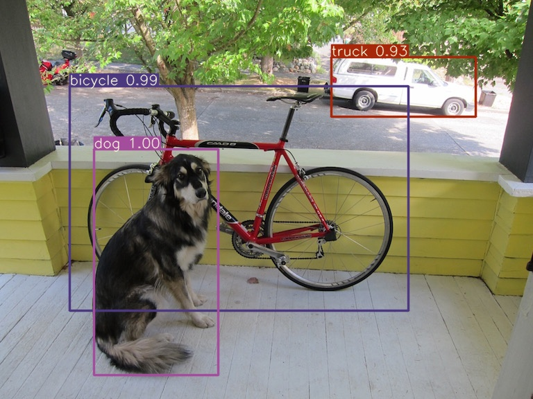

# YOLOv3-PyTorch

## Contents

- [Introduction](#introduction)
- [Getting Started](#getting-started)
    - [Requirements](#requirements)
    - [From PyPI](#from-pypi)
    - [Local Install](#local-install)
- [All pretrained model weights](#all-pretrained-model-weights)
- [Inference](#inference)
- [Test](#test)
- [Results](#results)
    - [COCO Object Detection](#coco-object-detection)
    - [VOC Object Detection](#voc-object-detection)
- [Results](#results)
- [Contributing](#contributing)
- [Credit](#credit)
    - [YOLOv3: An Incremental Improvement](#yolov3-an-incremental-improvement)

## Introduction

This repository contains an op-for-op PyTorch reimplementation of [YOLOv3: An Incremental Improvement](https://arxiv.org/pdf/1804.02767v1.pdf).

## Getting Started

### Requirements

- Python 3.10+
- PyTorch 2.0.0+
- CUDA 11.8+
- Ubuntu 22.04+

### From PyPI

```bash
pip install yolov3_pytorch -i https://pypi.org/simple
```

### Local Install

```bash
git clone https://github.com/Lornatang/YOLOv3-PyTorch.git
cd YOLOv3-PyTorch
pip install -r requirements.txt
pip install -e .
```

## All pretrained model weights

- [Google Driver](https://drive.google.com/drive/folders/1b5f3FSeZwIFs4bp17OWKhQeaEcMKJyma?usp=sharing)
- [Baidu Driver](https://pan.baidu.com/s/1GvepU_8APWChG_03yUVQ_w?pwd=7e0g)

## Inference

```shell
# Download pretrained model weights to `./results/pretrained_models`
wget https://github.com/Lornatang/YOLOv3-PyTorch/releases/download/0.1.5/YOLOv3_Tiny-COCO-20231107.pth.tar -O ./results/pretrained_models/YOLOv3_Tiny-COCO-20231107.pth.tar
python ./tools/inference.py ./data/examples/dog.jpg
# Loaded `./results/pretrained_models/YOLOv3_Tiny-COCO-20231107.pth.tar` models weights successfully.
# image 1/1 ./data/examples/dog.jpg: 320x416 1 bicycle, 2 car, 1 dog,
# See ./results/inference/dog.jpg for visualization.
```

<div align="center">

</div>

## Test

```shell
# Download dataset to `./data`
cd ./scripts
bash ./process_voc0712_dataset.sh
cd ..
# Download pretrained model weights to `./results/pretrained_models`
wget https://github.com/Lornatang/YOLOv3-PyTorch/releases/download/0.1.5/YOLOv3_Tiny-VOC-20231107.pth.tar -O ./results/pretrained_models/YOLOv3_Tiny-VOC-20231107.pth.tar
python ./tools/eval.py ./configs/VOC-Detection/yolov3_tiny.yaml
```

### Results

#### COCO Object Detection

|                                Name                                | Size | mAP<sup>val<br/>0.5:0.95 | FLOPs(G) | Parameters(M) | Memory(MB) |                                                       download                                                       |
|:------------------------------------------------------------------:|:----:|:------------------------:|:--------:|:-------------:|:----------:|:--------------------------------------------------------------------------------------------------------------------:|
|     [**yolov3_tiny**](configs/COCO-Detection/yolov3_tiny.yaml)     | 416  |           18.7           |   5.6    |     0.71      |    8.9     |   https://huggingface.co/goodfellowliu/YOLOv3-PyTorch/resolve/main/YOLOv3_Tiny-COCO-20231107.pth.tar?download=true   |
| [**yolov3_tiny_prn**](configs/COCO-Detection/yolov3_tiny_prn.yaml) | 416  |           11.1           |   3.5    |     0.66      |    4.9     | https://huggingface.co/goodfellowliu/YOLOv3-PyTorch/resolve/main/YOLOv3_Tiny_PRN-COCO-20231107.pth.tar?download=true |
|          [**yolov3**](configs/COCO-Detection/yolov3.yaml)          | 416  |           66.7           |   66.2   |     0.88      |    61.9    |     https://huggingface.co/goodfellowliu/YOLOv3-PyTorch/resolve/main/YOLOv3-COCO-20231107.pth.tar?download=true      |
|      [**yolov3_spp**](configs/COCO-Detection/yolov3_spp.yaml)      | 416  |           66.7           |   66.5   |     0.88      |    63.0    |   https://huggingface.co/goodfellowliu/YOLOv3-PyTorch/resolve/main/YOLOv3_SPP-COCO-20231107.pth.tar?download=true    |

#### VOC Object Detection

|                                  Model                                  | Size | mAP<sup>val<br/>0.5:0.95 | FLOPs(B) | Memory(MB) | Parameters(M) |                                                        download                                                        |
|:-----------------------------------------------------------------------:|:----:|:------------------------:|:--------:|:----------:|:-------------:|:----------------------------------------------------------------------------------------------------------------------:|
|        [**yolov3_tiny**](configs/VOC-Detection/yolov3_tiny.yaml)        | 416  |           58.8           |   5.5    |    0.27    |      8.7      |    https://huggingface.co/goodfellowliu/YOLOv3-PyTorch/resolve/main/YOLOv3_Tiny-VOC-20231107.pth.tar?download=true     |
|    [**yolov3_tiny_prn**](configs/VOC-Detection/yolov3_tiny_prn.yaml)    | 416  |           47.9           |   3.5    |    0.27    |      4.9      |  https://huggingface.co/goodfellowliu/YOLOv3-PyTorch/resolve/main/YOLOv3_Tiny_PRN-VOC-20231107.pth.tar?download=true   |
|             [**yolov3**](configs/VOC-Detection/yolov3.yaml)             | 416  |           82.9           |   65.7   |    0.61    |     61.6      |       https://huggingface.co/goodfellowliu/YOLOv3-PyTorch/resolve/main/YOLOv3-VOC-20231107.pth.tar?download=true       |
|         [**yolov3_spp**](configs/VOC-Detection/yolov3_spp.yaml)         | 416  |           83.2           |   66.1   |    0.88    |     62.7      |     https://huggingface.co/goodfellowliu/YOLOv3-PyTorch/resolve/main/YOLOv3_SPP-VOC-20231107.pth.tar?download=true     |
| [**yolov3_mobilenetv1**](configs/VOC-Detection/yolov3_mobilenetv1.yaml) | 416  |           65.6           |   6.6    |    0.69    |      6.2      | https://huggingface.co/goodfellowliu/YOLOv3-PyTorch/resolve/main/YOLOv3_MobileNetV1-VOC-20231107.pth.tar?download=true |
| [**yolov3_mobilenetv2**](configs/VOC-Detection/yolov3_mobilenetv2.yaml) | 416  |           68.2           |   3.5    |    0.49    |      4.3      | https://huggingface.co/goodfellowliu/YOLOv3-PyTorch/resolve/main/YOLOv3_MobileNetV2-VOC-20231107.pth.tar?download=true |
|       [**yolov3_vgg16**](configs/VOC-Detection/yolov3_vgg16.yaml)       | 416  |           74.1           |  122.8   |    0.74    |     35.5      |    https://huggingface.co/goodfellowliu/YOLOv3-PyTorch/resolve/main/YOLOv3_VGG16-VOC-20231107.pth.tar?download=true    |

## Train

### VOC

```shell
# Download dataset to `./data`
cd ./scripts
bash ./process_voc0712_dataset.sh
cd ..
# Download pretrained model weights to `./results/pretrained_models`
wget https://github.com/Lornatang/YOLOv3-PyTorch/releases/download/0.1.5/YOLOv3_Tiny-VOC-20231107.pth.tar -O ./results/pretrained_models/YOLOv3_Tiny-VOC-20231107.pth.tar
# change WEIGHTS_PATH in ./configs/VOC-Detection/yolov3_tiny.yaml
python ./tools/train.py ./configs/VOC-Detection/yolov3_tiny.yaml
```

### COCO

```shell
# COCO2014
# Download dataset to `./data`
cd ./scripts
bash ./process_coco2014_dataset.sh
cd ..
# Download pretrained model weights to `./results/pretrained_models`
wget https://github.com/Lornatang/YOLOv3-PyTorch/releases/download/0.1.5/YOLOv3_Tiny-COCO-20231107.pth.tar -O ./results/pretrained_models/YOLOv3_Tiny-COCO-20231107.pth.tar
# change WEIGHTS_PATH in ./configs/COCO-Detection/yolov3_tiny.yaml
python ./tools/train.py ./configs/COCO-Detection/yolov3_tiny.yaml

### Custom dataset

Details see [CustomDataset.md](./data/README.md).

## Contributing

If you find a bug, create a GitHub issue, or even better, submit a pull request. Similarly, if you have questions,
simply post them as GitHub issues.

I look forward to seeing what the community does with these models!

### Credit

#### YOLOv3: An Incremental Improvement

_Joseph Redmon, Ali Farhadi_ <br>

**Abstract** <br>
We present some updates to YOLO! We made a bunch of little design changes to make it better. We also trained
this new network that’s pretty swell. It’s a little bigger than last time but more accurate. It’s still fast though,
don’t worry. At 320 × 320 YOLOv3 runs in 22 ms at 28.2 mAP, as accurate as SSD but three times faster. When we look at
the old .5 IOU mAP detection metric YOLOv3 is quite good. It achieves 57.9 AP50 in 51 ms on a Titan X, compared to 57.5
AP50 in 198 ms by RetinaNet, similar performance but 3.8× faster. As always, all the code is online
at https://pjreddie.com/yolo/.

[[Paper]](https://pjreddie.com/media/files/papers/YOLOv3.pdf) [[Project Webpage]](https://pjreddie.com/darknet/yolo/) [[Authors' Implementation]](https://github.com/pjreddie/darknet)

```bibtex
@article{yolov3,
  title={YOLOv3: An Incremental Improvement},
  author={Redmon, Joseph and Farhadi, Ali},
  journal = {arXiv},
  year={2018}
}
```
