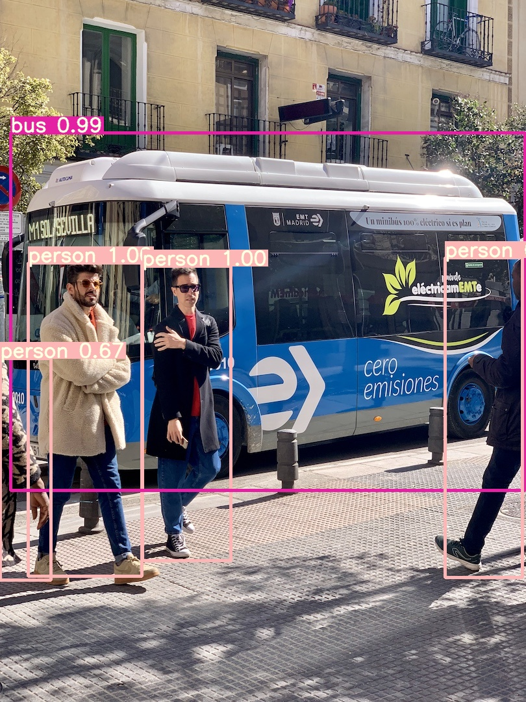
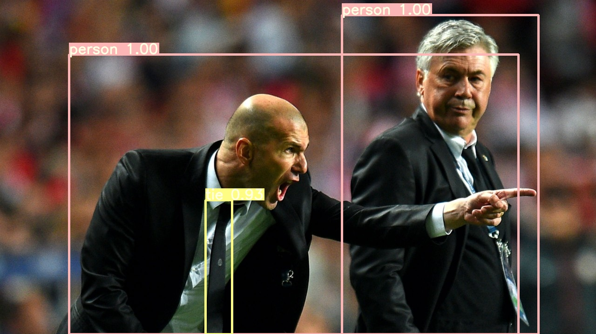

# YOLOv3-PyTorch

<p align="center"></p>
<p align="center"></p>
<p align="center"></p>

### Overview
The inspiration for this project comes from [ultralytics/yolov3](https://github.com/ultralytics/yolov3) Thanks.

This project is a [YOLOv3](http://arxiv.org/abs/1804.02767) object detection system. Development framework by [PyTorch](https://pytorch.org/).

The goal of this implementation is to be simple, highly extensible, and easy to integrate into your own projects. This implementation is a work in progress -- new features are currently being implemented.  

### Table of contents
1. [About YOLOv3](#about-yolov3)
2. [Installation](#installation)
    * [Clone and install requirements](#clone-and-install-requirements)
    * [Download pre-trained weights](#download-pre-trained-weights)
    * [Download COCO2014](#download-coco2014)
3. [Usage](#usage)
    * [Train](#train)
    * [Test](#test)
    * [Inference](#inference)
4. [Backbone](#backbone)
5. [Train on Custom Dataset](#train-on-custom-dataset)
6. [Darknet Conversion](#darknet-conversion)
7. [Credit](#credit) 

### About YOLOv3
We present some updates to YOLO! We made a bunch of little design changes to make it better. We also trained this new network that's pretty swell. It's a little bigger than last time but more accurate. It's still fast though, don't worry. At 320x320 YOLOv3 runs in 22 ms at 28.2 mAP, as accurate as SSD but three times faster. When we look at the old .5 IOU mAP detection metric YOLOv3 is quite good. It achieves 57.9 mAP@50 in 51 ms on a Titan X, compared to 57.5 mAP@50 in 198 ms by RetinaNet, similar performance but 3.8x faster. As always, all the code is online at this https URL

### Installation

#### Clone and install requirements
```bash
$ git clone https://github.com/Lornatang/YOLOv3-PyTorch.git
$ cd YOLOv3-PyTorch/
$ pip3 install -r requirements.txt
```

#### Download pre-trained weights
```bash
$ cd weights/
$ bash download_weights.sh
```

#### Download COCO2014
```bash
$ cd data/
$ bash get_coco_dataset.sh
```
    
### Usage

#### Train
```bash
usage: train.py [-h] [--epochs EPOCHS] [--batch-size BATCH_SIZE] [--accumulate ACCUMULATE]
                [--cfg CFG] [--data DATA] [--multi-scale] [--img-size IMG_SIZE [IMG_SIZE ...]]
                [--rect] [--resume] [--nosave] [--notest] [--evolve] [--cache-images]
                [--weights WEIGHTS] [--arc ARC] [--name NAME] [--device DEVICE] [--adam]
                [--single-cls] [--var VAR]
```

- Example (COCO2014)

To train on COCO2014 using a Darknet-53 backend pretrained on ImageNet run: 
```bash
$ python3 train.py --cfg cfgs/yolov3.cfg  --data cfgs/coco2014.data --weights weights/darknet53.conv.74 --multi-scale
```

- Example (VOC2007+2012)

To train on VOC07+12:
```bash
$ python3 train.py --cfg cfgs/yolov3-voc.cfg  --data cfgs/voc2007.data --weights weights/darknet53.conv.74 --multi-scale
```

- Other training methods

**Normal Training:** `python3 train.py` to begin training after downloading COCO data with `data/get_coco_dataset.sh`. Each epoch trains on 117,263 images from the train and validate COCO sets, and tests on 5000 images from the COCO validate set.

**Resume Training:** `python3 train.py --resume` to resume training from `weights/checkpoint.pth`.

#### Test

- mAP@0.5 run at `--iou-threshold 0.5`, mAP@0.5...0.95 run at `--iou-threshold 0.7`
- Darknet results: https://arxiv.org/abs/1804.02767

|     Method   |  Size   |COCO mAP<br>@0.5...0.95 |COCO mAP<br>@0.5 |  
---                          | ---         | ---         | ---
YOLOv3-tiny<br>YOLOv3<br>YOLOv3-SPP<br>    |320          |14.0<br>28.7<br>30.5<br>|29.1<br>51.8<br>52.3<br>
YOLOv3-tiny<br>YOLOv3<br>YOLOv3-SPP<br>    |416          |16.0<br>31.2<br>33.9<br>|33.0<br>55.4<br>56.9<br>
YOLOv3-tiny<br>YOLOv3<br>YOLOv3-SPP<br>    |512          |16.6<br>32.7<br>35.6<br>|34.9<br>57.7<br>59.5<br>
YOLOv3-tiny<br>YOLOv3<br>YOLOv3-SPP<br>    |608          |16.6<br>33.1<br>37.0<br>|35.4<br>58.2<br>60.7<br>

```bash
$ python3 test.py --cfg cfgs/yolov3-spp.cfg --weights weights/yolov3-spp.pth --augment --save-json --image-size 608 
```

```text
Namespace(augment=True, batch_size=16, cfg='cfgs/yolov3-spp.cfg', confidence_threshold=0.001, data='data/coco2014.data', device='', image_size=608, iou_threshold=0.6, save_json=True, single_cls=False, task='eval', weights='weights/yolov3-spp.pth', workers=4)
Using CUDA 
    + device:0 (name='TITAN RTX', total_memory=24190MB)

 Average Precision  (AP) @[ IoU=0.50:0.95 | area=   all | maxDets=100 ] = 0.454
 Average Precision  (AP) @[ IoU=0.50      | area=   all | maxDets=100 ] = 0.644
 Average Precision  (AP) @[ IoU=0.75      | area=   all | maxDets=100 ] = 0.497
 Average Precision  (AP) @[ IoU=0.50:0.95 | area= small | maxDets=100 ] = 0.270
 Average Precision  (AP) @[ IoU=0.50:0.95 | area=medium | maxDets=100 ] = 0.504
 Average Precision  (AP) @[ IoU=0.50:0.95 | area= large | maxDets=100 ] = 0.577
 Average Recall     (AR) @[ IoU=0.50:0.95 | area=   all | maxDets=  1 ] = 0.363
 Average Recall     (AR) @[ IoU=0.50:0.95 | area=   all | maxDets= 10 ] = 0.599
 Average Recall     (AR) @[ IoU=0.50:0.95 | area=   all | maxDets=100 ] = 0.668
 Average Recall     (AR) @[ IoU=0.50:0.95 | area= small | maxDets=100 ] = 0.502
 Average Recall     (AR) @[ IoU=0.50:0.95 | area=medium | maxDets=100 ] = 0.724
 Average Recall     (AR) @[ IoU=0.50:0.95 | area= large | maxDets=100 ] = 0.805
```

#### Inference

`detect.py` runs inference on any sources:

```bash
$ python3 detect.py --source ...
```

- Image:  `--source file.jpg`
- Video:  `--source file.mp4`
- Directory:  `--source dir/`
- Webcam:  `--source 0`
- HTTP stream:  `--source https://v.qq.com/x/page/x30366izba3.html`

To run a specific models:

**YOLOv3:** `python3 detect.py --cfg cfgs/yolov3.cfg --weights weights/yolov3.weights`  

**YOLOv3-tiny:** `python3 detect.py --cfg cfgs/yolov3-tiny.cfg --weights weights/yolov3-tiny.weights`  

**YOLOv3-SPP:** `python3 detect.py --cfg cfgs/yolov3-spp.cfg --weights weights/yolov3-spp.weights` 

### Backbone
In addition to some architectures given by the author, we also add 
some commonly used neural network architectures, which usually have 
better mAP and less computation than the original architecture.

* All training and tests at image size:(416 x 416) for GeForce RTX 2080 Ti.

**Note**: All commands use the following parameters.

```text
python3 train.py --cfg <cfg-path> --data cfgs/voc2007.data --multi-scale --cache-image --batch-size 8
```

|     Backbone     |  Train  | Test |train time (s/iter)|inference time (s/im)|train mem (GB)|mAP     |  Cfg  |  Weights   |  
|:-----------------|:-------:|:----:|:-----------------:|:-------------------:|:------------:|:------:|:-----:|:----------:|
|YOLOv3-tiny       |VOC07+12 |VOC07 |0.047              |0.005                |2.7           |57.7    |[Link](https://github.com/Lornatang/YOLOv3-PyTorch/blob/master/cfgs/voc/yolov3-tiny.cfg)|[weights](https://github.com/Lornatang/YOLOv3-PyTorch/releases/download/1.0/yolov3-tiny-f8ffbd77.pth)|
|MobileNet-v1      |VOC07+12 |VOC07 |0.090              |0.004                |2.8           |61.4    |[Link](https://github.com/Lornatang/YOLOv3-PyTorch/blob/master/cfgs/voc/mobilenetv1.cfg)|[weights](https://github.com/Lornatang/YOLOv3-PyTorch/releases/download/1.0/mobilenetv1-189a5a58.pth)|
|MobileNet-v2      |VOC07+12 |VOC07 |0.116              |0.004                |5.8           |**62.3**|[Link](https://github.com/Lornatang/YOLOv3-PyTorch/blob/master/cfgs/voc/mobilenetv2.cfg)|[weights](https://github.com/Lornatang/YOLOv3-PyTorch/releases/download/1.0/mobilenetv2-b63c09ce.pth)|
|MobileNet-v3-small|VOC07+12 |VOC07 |**0.073**          |**0.003**            |**1.9**       |53.3    |[Link](https://github.com/Lornatang/YOLOv3-PyTorch/blob/master/cfgs/voc/mobilenetv3-small.cfg)|[weights](https://github.com/Lornatang/YOLOv3-PyTorch/releases/download/1.0/mobilenetv3-small-cbb8f75e.pth)|
|MobileNet-v3-large|VOC07+12 |VOC07 |0.125              |0.004                |5.7           |59.5    |[Link](https://github.com/Lornatang/YOLOv3-PyTorch/blob/master/cfgs/voc/mobilenetv3-large.cfg)|[weights](https://github.com/Lornatang/YOLOv3-PyTorch/releases/download/1.0/mobilenetv3-large-55b6226b.pth)|
|ShuffleNet-v1     |VOC07+12 |VOC07 |0.125              |0.004                |2.1           |-       |[Link](https://github.com/Lornatang/YOLOv3-PyTorch/blob/master/cfgs/voc/shufflenetv1.cfg)|-|
|ShuffleNet-v2     |VOC07+12 |VOC07 |-                  |-                    |-             |-       |[Link](https://github.com/Lornatang/YOLOv3-PyTorch/blob/master/cfgs/voc/shufflenetv2.cfg)|-|
|AlexNet           |VOC07+12 |VOC07 |-                  |-                    |-             |-       |[Link](https://github.com/Lornatang/YOLOv3-PyTorch/blob/master/cfgs/voc/alexnet.cfg)|-|
|VGG16             |VOC07+12 |VOC07 |0.194              |0.010                |7.8           |73.7    |[Link](https://github.com/Lornatang/YOLOv3-PyTorch/blob/master/cfgs/voc/vgg16.cfg)|[weights](https://github.com/Lornatang/YOLOv3-PyTorch/releases/download/1.0/vgg16-830bb8f5.pth)|


### Train on Custom Dataset
Run the commands below to create a custom model definition, replacing `your-dataset-num-classes` with the number of classes in your dataset.

```bash
# move to configs dir
$ cd cfgs/
# create custom model 'yolov3-custom.cfg'. (In fact, it is OK to modify two lines of parameters, see `create_model.sh`)                              
$ bash create_model.sh your-dataset-num-classes
```

#### Classes
Add class names to `data/custom/classes.names`. This file should have one row per class name.

#### Image Folder
Move the images of your dataset to `data/custom/images/`.

#### Annotation Folder
Move your annotations to `data/custom/labels/`. The dataloader expects that the annotation file corresponding to the image `data/custom/images/train.jpg` has the path `data/custom/labels/train.txt`. Each row in the annotation file should define one bounding box, using the syntax `label_idx x_center y_center width height`. The coordinates should be scaled `[0, 1]`, and the `label_idx` should be zero-indexed and correspond to the row number of the class name in `data/custom/classes.names`.

#### Define Train and Validation Sets
In `data/custom/train.txt` and `data/custom/valid.txt`, add paths to images that will be used as train and validation data respectively.

#### Training
To train on the custom dataset run:

```bash
$ python3 train.py --cfg cfgs/yolov3-custom.cfg --data cfg/custom.data --epochs 100 --multi-scale
```

Add `--weights weights/darknet53.conv.74` to train using a backend pretrained on ImageNet.

### Darknet Conversion

```bash
$ git clone https://github.com/Lornatang/YOLOv3-PyTorch && cd YOLOv3-PyTorch

# convert darknet cfgs/weights to pytorch model
$ python3  -c "from easydet.utils import convert; convert('cfgs/yolov3-spp.cfgs', 'weights/yolov3-spp.weights')"
Success: converted 'weights/yolov3-spp.weights' to 'converted.pth'

# convert cfgs/pytorch model to darknet weights
$ python3  -c "from easydet.utils import convert; convert('cfgs/yolov3-spp.cfgs', 'weights/yolov3-spp.pth')"
Success: converted 'weights/yolov3-spp.pth' to 'converted.weights'
```

### Credit

#### YOLOv3: An Incremental Improvement
_Joseph Redmon, Ali Farhadi_ <br>

**Abstract** <br>
We present some updates to YOLO! We made a bunch
of little design changes to make it better. We also trained
this new network that’s pretty swell. It’s a little bigger than
last time but more accurate. It’s still fast though, don’t
worry. At 320 × 320 YOLOv3 runs in 22 ms at 28.2 mAP,
as accurate as SSD but three times faster. When we look
at the old .5 IOU mAP detection metric YOLOv3 is quite
good. It achieves 57.9 AP50 in 51 ms on a Titan X, compared
to 57.5 AP50 in 198 ms by RetinaNet, similar performance
but 3.8× faster. As always, all the code is online at
https://pjreddie.com/yolo/.

[[Paper]](https://pjreddie.com/media/files/papers/YOLOv3.pdf) [[Project Webpage]](https://pjreddie.com/darknet/yolo/) [[Authors' Implementation]](https://github.com/pjreddie/darknet)

```
@article{yolov3,
  title={YOLOv3: An Incremental Improvement},
  author={Redmon, Joseph and Farhadi, Ali},
  journal = {arXiv},
  year={2018}
}
```
