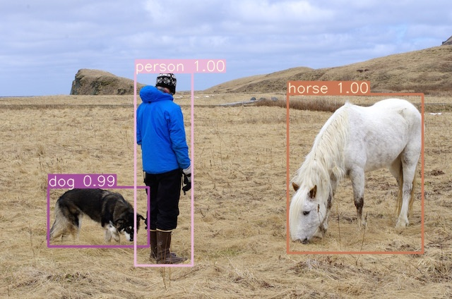

# YOLOv3-PyTorch

## Overview

This repository contains an op-for-op PyTorch reimplementation
of [YOLOv3: An Incremental Improvement](https://arxiv.org/pdf/1804.02767v1.pdf).

## Table of contents

- [YOLOv3-PyTorch](#yolov3-pytorch)
    - [Overview](#overview)
    - [Table of contents](#table-of-contents)
    - [Download weights](#download-weights)
    - [Download datasets](#download-datasets)
    - [How Test and Train](#how-test-and-train)
        - [Test yolov3_tiny_voc model](#test-yolov3tinyvoc-model)
        - [Train yolov3_tiny_voc model](#train-yolov3tinyvoc-model)
        - [Resume train yolov3_tiny_voc model](#resume-train-yolov3tinyvoc-model)
    - [Result](#result)
    - [Contributing](#contributing)
    - [Credit](#credit)
        - [YOLOv3: An Incremental Improvement](#yolov3--an-incremental-improvement)

## Download weights

- [Google Driver](https://drive.google.com/drive/folders/17ju2HN7Y6pyPK2CC_AqnAfTOe9_3hCQ8?usp=sharing)
- [Baidu Driver](https://pan.baidu.com/s/1yNs4rqIb004-NKEdKBJtYg?pwd=llot)

## Download datasets

- [Google Driver](https://drive.google.com/drive/folders/1xuXk-uvAe-F2m6oxbOQB3DFM573GPN57?usp=share_link)
- [Baidu Driver](https://pan.baidu.com/s/1UsLQvMLbm1uhv-tYTL2q-w?pwd=llot)

Please refer to `README.md` in the `data` directory for the method of making a dataset.

## How Test and Train

Both training and testing only need to modify the `train_config.py` or `test_config.py` file.

### Test yolov3_tiny_voc model

Modify the `test_config.py` file.

- line 18: `model_arch_name` change to `yolov3_tiny_voc`.
- line 34: `test_dataset_config_path` change to `./data/voc.data`.
- line 38: `model_weights_path` change to `./results/pretrained_models/YOLOv3_tiny-COCO.weights`.

```bash
python3 test.py
```

### Train yolov3_tiny_voc model

Modify the `train_config.py` file.

- line 18: `model_arch_name` change to `yolov3_tiny_voc`.
- line 58: `upscale_factor` change to `./data/voc.data`.

```bash
python3 train.py
```

### Resume train yolov3_tiny_voc model

Modify the `train_config.py` file.

- line 18: `model_arch_name` change to `yolov3_tiny_voc`.
- line 58: `upscale_factor` change to `./data/voc.data`.
- line 74: `resume_model_weights_path` change to `f"./samples/YOLOv3_tiny-VOC0712/epoch_xxx.pth.tar"`.

```bash
python3 train.py
```

## Result

Source of original paper results: [https://arxiv.org/pdf/1804.02767v1.pdf](https://arxiv.org/pdf/1804.02767v1.pdf)

In the following table, the mAP value in `()` indicates the result of the project, and `-` indicates no test.

|         Model         |   Train dataset   | Test dataset |     mAP     | 
|:---------------------:|:-----------------:|:------------:|:-----------:|
|  yolov3_tiny_prn_voc  | VOC07+12 trainval |  VOC07 test  | -(**7.25**) |
|    yolov3_tiny_voc    | VOC07+12 trainval |  VOC07 test  | -(**6.39**) |
|    mobilenetv1_voc    | VOC07+12 trainval |  VOC07 test  | -(**8.06**) |
|    mobilenetv2_voc    | VOC07+12 trainval |  VOC07 test  | -(**5.50**) |
| mobilenetv3_small_voc | VOC07+12 trainval |  VOC07 test  | -(**5.50**) |
| mobilenetv3_large_voc | VOC07+12 trainval |  VOC07 test  | -(**5.50**) |

```bash
# Download `BSRGAN_x4-DIV2K-6d507222.pth.tar` weights to `./results/pretrained_models`
# More detail see `README.md<Download weights>`
python3 ./detect.py
```

Output1:

<span align="center"></span>

Output2:

<span align="center"></span>

```text
Loaded `` pretrained model weights successfully.
image 1/2 data/examples/dog.jpg: 480x608 1 bicycle, 1 car, 1 dog, 
image 2/2 data/examples/person.jpg: 416x608 1 dog, 1 person, 1 sheep,
```

## Contributing

If you find a bug, create a GitHub issue, or even better, submit a pull request. Similarly, if you have questions,
simply post them as GitHub issues.

I look forward to seeing what the community does with these models!

### Credit

#### YOLOv3: An Incremental Improvement

_Joseph Redmon, Ali Farhadi_ <br>

**Abstract** <br>
We present some updates to YOLO! We made a bunch of little design changes to make it better. We also trained
this new network that’s pretty swell. It’s a little bigger than last time but more accurate. It’s still fast though,
don’t worry. At 320 × 320 YOLOv3 runs in 22 ms at 28.2 mAP, as accurate as SSD but three times faster. When we look at
the old .5 IOU mAP detection metric YOLOv3 is quite good. It achieves 57.9 AP50 in 51 ms on a Titan X, compared to 57.5
AP50 in 198 ms by RetinaNet, similar performance but 3.8× faster. As always, all the code is online
at https://pjreddie.com/yolo/.

[[Paper]](https://pjreddie.com/media/files/papers/YOLOv3.pdf) [[Project Webpage]](https://pjreddie.com/darknet/yolo/) [[Authors' Implementation]](https://github.com/pjreddie/darknet)

```bibtex
@article{yolov3,
  title={YOLOv3: An Incremental Improvement},
  author={Redmon, Joseph and Farhadi, Ali},
  journal = {arXiv},
  year={2018}
}
```
